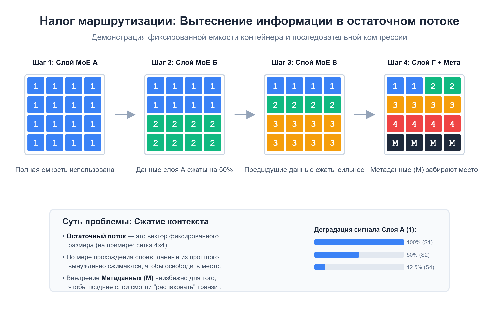

# Скрытый налог Трансформеров: Как градиентный спуск превратил LLM в ZIP-архиваторы и путь к когнитивной диффузии

**Теги:** *Машинное обучение, Искусственный интеллект, Архитектура ПО, Нейронные сети, Transformers, LLM*

В современной парадигме LLM принято считать, что миллиарды параметров в слоях Attention и Mixture-of-Experts (MoE) тратятся исключительно на полезную работу: хранение фактов, извлечение паттернов и логические рассуждения. Однако, если посмотреть на физику передачи информации внутри классического остаточного потока (Residual Stream), вскрывается фундаментальный архитектурный изъян.

Исторически архитектурный пайплайн передачи данных по оси глубины был «пущен на самотек». Оставшись без выделенной системной шины маршрутизации, градиентный спуск (SGD) был вынужден выживать. Он автоматизированно перепрофилировал драгоценные рабочие параметры нейросети под создание тяжеловесных служебных протоколов связи. 

В этой статье мы разберем, как этот «налог на маршрутизацию» ломает концепцию чистых экспертов, почему разбухание векторов — это не баг, а эволюционная стратегия выживания сети, и как это связано с грядущим переходом к диффузионным архитектурам.

<cut />

> **🚨 От автора (Disclaimer):** 
> *Всё описанное ниже — это архитектурные рассуждения, концептуальные гипотезы и попытка взглянуть на физику движения информации в нейросетях под нестандартным углом. Я не претендую на абсолютную истину: факты и предположения требуют строгой эмпирической проверки, а у меня, как у независимого разработчика, нет вычислительных ресурсов масштаба OpenAI или DeepMind для их тестирования. Воспринимайте этот текст как invitation to discussion — приглашение к дискуссии об архитектурных «узких местах» и о том, куда мы движемся дальше.*

---

### Проблема 1. Слепой пайплайн и вынужденная криптография

Классическая архитектура предоставляет слоям лишь один общий вектор-контейнер для обмена данными. Если раннему 5-му слою нужно передать критически важный факт 50-му слою-потребителю, этот сигнал должен выжить, пройдя через 44 промежуточных блока.

Из-за того, что сеть оставлена наедине с этой проблемой, внутри весов стихийно выстраивается **скрытая логистическая инфраструктура**:

1. **Скрытая сериализация (Упаковка):** Контейнер вынужден запоминать не только сам «вектор знаний», но и методы его кодирования. Ранний слой зашифровывает факты в многомерную суперпозицию, снабжая её скрытым ключом (адресом).
2. **Вынужденное переплетение (Entanglement):** Промежуточные слои тратят свою вычислительную емкость на то, чтобы бережно проносить эти заархивированные пакеты через себя, переплетая чужой транзитный сигнал со своими вычислениями так, чтобы не разрушить его матричными умножениями.
3. **Десериализация (Распаковка):** Глубоким слоям приходится расходовать миллионы параметров на создание «дешифраторов». Они обязаны отфильтровать накопившийся шум, распознать ключ, «разжать» контейнер и лишь потом приступить к полезной обработке.

**Итог:** Модель расходует гигантскую часть своего «интеллекта» на функции системного роутера и банального ZIP-архиватора.

*Скрытая логистическая инфраструктура остаточного потока. Промежуточные слои функционируют как вынужденные маршрутизаторы, переплетая и дешифруя транзитные представления.*

---

### Проблема 2. «Разбухание контейнера» как стратегия выживания

Академические статьи часто описывают неконтролируемый рост значений вектора по мере прохождения слоев (*PreNorm Dilution / Output Magnitude growth*) как чисто математический недостаток функции сложения. 

Но через призму проблемы маршрутизации становится ясна истинная физическая причина: **разбухание — это вынужденная адаптация**.

Когда десятки блоков пытаются записать свои запароленные архивы в одну узкую трубу, возникает жесточайшая интерференция. Как раннему слою гарантировать, что его архив не сотрется? Ответ: начать математически «кричать». Слои вынуждены экспоненциально выкручивать амплитуду своих выходов, чтобы их данные доминировали над шумом последующих слоев. Разбухание — это крик о помощи в условиях отсутствия нормальной шины роутинга.

---

### Проблема 3. Тупик MoE и «защитное дублирование» примитивов

Архитектура *Mixture-of-Experts (MoE)* задумывалась как элегантная база узкоспециализированных знаний. Но из-за сломанного пайплайна эксперты оказались в заложниках. Градиентный спуск заставляет их быть не только знатоками своей области, но и криптографами.

Из-за однонаправленной природы пайплайна (данные идут только вперед) возникает критическая проблема: **невозможность пересмотра и полное отсутствие обратной связи**. Ранние слои работают вслепую — у них нет возможности обратиться к конечным слоям и спросить, какие именно грани данных понадобятся в конце логической цепочки. 

Как следствие, MoE вынуждены заниматься **защитным дублированием**. Они сохраняют и транслируют дальше избыточные примитивы, обрывки контекста и дублирующуюся информацию просто «на всякий случай». Именно эта невозможность архитектурно «пересмотреть» свои выводы порождает дублирование знаний в параметрах, а также галлюцинации и логические сбои при генерации сложных ответов (System 2 thinking).

---

### Компромисс реальности: Вектор исправлений (Attention Residuals)

Индустрия начинает осознавать проблему. В недавнем препринте от команды Moonshot AI / Kimi (*Attention Residuals, arXiv:2603.15031*) предложен красивый вектор исправлений, учитывающий жесткие ограничения современных вычислительных мощностей.

Понимая, что полная переработка стоит дорого, авторы нормализовали пайплайн. Они убрали жесткое сложение (накопление) и ввели механизм Attention по оси глубины. Поздние слои получили возможность точечно обращаться к конкретным ранним слоям, минуя компрессию. Нагрузка на «контейнеры» резко упала, а эффективная шина данных увеличилась в размерности.

Это потрясающее достижение, но нужно признать: оно остается компромиссом. Факт остается фактом: архитектура *Attention Residuals* решает проблему извлечения данных из прошлого, но **оставляет пайплайн строго однонаправленным**. Первые MoE по-прежнему лишены обратной взаимосвязи с последующими, а значит, первопричина «дублирования» и невозможности пересмотра не устранена.

---

### Видение будущего: Архитектура «Latent Cognitive Diffusion» (Гибрид MoE)

Как избавиться от "вынужденного дублирования" и научить сеть истинной рефлексии? Концептуальный ответ лежит в гибриде парадигмы MoE и принципов диффузионных моделей, работающих прямо в скрытом пространстве (Latent Space).

Понятно, что сегодня это требует колоссальных, практически недоступных вычислительных ресурсов. Но в идеале процесс генерации должен перейти от линейного пайплайна к **циклу консенсуса**:

1. **Первичная (прямая) диффузия (Веер гипотез):** Различные эксперты (MoE) параллельно распаковывают свои независимые срезы знаний, формируя многомерное «облако сырых гипотез».
2. **Обратная диффузия (Кросс-рефлексия):** ВСЕ сгенерированные состояния не идут слепо дальше по трубе. Они направляются **назад** и прогоняются через каждого эксперта заново. Возникает обратная взаимосвязь: глубокий эксперт по логике корректирует и дополняет ранние данные эксперта по фактам.
3. **Схлопывание (Консенсус):** Итеративный прогон (денойзинг) продолжается, пока эксперты взаимно не вычистят шум и не разрешат противоречия. Только после этого облако схлопывается в детерминированный вектор, свободный от дублирования примитивов.

Разумеется, гонять данные туда-обратно через пулы экспертов означает кратное падение скорости инференса и рост требований к железу. Но вектор задан. Нейросети будущего перестанут быть однонаправленными курьерами-архиваторами и станут полноценными когнитивными системами, где знания не просто передаются, а итеративно *осознаются*.